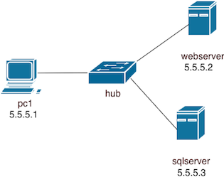

Instituto Superior Técnico, Universidade de Lisboa

**Segurança Informática em Redes e Sistemas**

# Guia de Laboratório - *Nmap*

## Objetivo

O objetivo deste laboratório é aprender as potencialidades do *Nmap* ("Network Mapper"). O *Nmap* é uma ferramenta de código aberto amplamente utilizada para descoberta de máquinas e serviços numa rede. Permite identificar máquinas ativas, portas abertas, serviços em execução e, em muitos casos, obter informação útil sobre versões e sistemas operativos, sendo por isso muito usado em tarefas de administração, diagnóstico e auditoria de segurança.

O laboratório usa uma rede semelhante à do laboratório no qual foi configurado um servidor *web* e uma *firewall*. A topologia da rede contém um PC, um servidor *web* e um servidor SQL, estando o PC numa LAN, e os restantes dispositivos noutra LAN interligados por um *hub* (um *collision domain* do Kathará):




Em primeiro lugar, vamos configurar um servidor *web* *Apache* e um servidor de base de dados *SQL* que será usado pelo servidor *web*.
Depois vamos então explorar o comando *Nmap*.


## Exercício 1 — *Nmap* básico

1. Inicie o laboratório:
```bash
kathara lstart
```
Verifique que os serviços estão ativos:

2. Verifique que no `webserver` o serviço `apache2` está em execução.
```bash
/etc/init.d/apache2 status
```

Se não estiver, execute-o.


3. O posto de trabalho vai ser o `pc1`. Confirme que o *Nmap* está instalado executando:

```bash
nmap --version
```

4.  O primeiro passo de um auditor é identificar quais os sistemas ativos na rede alvo. Execute um scan apenas para descobrir hosts ativos:

```bash
nmap -sn <ip_da_rede_alvo>
```

5. Execute um scan às portas TCP mais comuns dos hosts ativos descobertos no ponto anterior:

```bash
nmap <ip_do_host>
```
Repare nas portas abertas dos servidores. Nesta fase, deverão estar ambas no estado *open*.


6. Numa arquitetura segura, o servidor de base de dados nunca deve estar exposto diretamente à rede dos utilizadores (onde está o pc1).
Aceda ao `.startup` da firewall  e modifique o set de regras de forma a que o tráfego direcionado à porta ativa do `sqlserver` fique bloqueado.

7. Depois de modificar a regra na firewall, repita o scan efetuado no passo 5, direcionado agora apenas ao `sqlserver`.

```bash
nmap -p <active_port_sqlserver> <ip_sqlserver>
```

- Qual a alteração no estado da porta ativa neste server?
- Qual a diferença entre *open*, *closed* e *filtered*?
- Porque é que a mudança de regras de Firewall resulta num estado filtered e não closed?


8. Execute um scan completo de portas TCP do `webserver`. 
```bash
nmap -p- <ip_webserver>
```
- Porque é que este comando demora significativamente mais?
- Em que situações é necessário realizar um scan completo em vez de um scan rápido?

9. Agora que compreende como analisar um único alvo, execute um scan de portas transversal a toda a subrede:

```bash
nmap <ip_da_rede_alvo>
```
- Este tipo de scan é considerado mais "ruídoso" (gera muito tráfego). Numa auditoria real, quais as desvantagens de correr este comando contra uma rede inteira sem autorização prévia?
---

## Exercício 2 — Descoberta de serviços

O *Nmap* pode usar heurísticas para compreender mais sobre as máquinas da rede. 

1. Um primeiro caso, é a deteção de serviços e as respetivas versões, usando o comando seguinte, que restringe os portos inspecionados:

```bash
nmap -sV -p <port_webserver> <ip_webserver>
```

Compare o comando acima com:
```bash
nmap -sV <ip_webserver>
```

- Qual a diferença no tempo de execução?
- Que informação adicional é obtida?
- Como pode essa informação (ex: versão do Apache) ser utilizada por um atacante?

---

## Exercício 3 — Identificação do sistema operativo

O Nmap pode inferir o sistema operativo através da análise da pilha TCP/IP.

```bash
nmap -O <ip_webserver>
```

- O sistema operativo identificado corresponde ao real?
- Que impacto pode ter uma firewall que bloqueie certos tipos de pacotes nesta deteção?

---

## Referências

- Nmap Documentation: https://nmap.org/book/man.html  
- Kathará Wiki: https://github.com/KatharaFramework/Kathara/wiki
